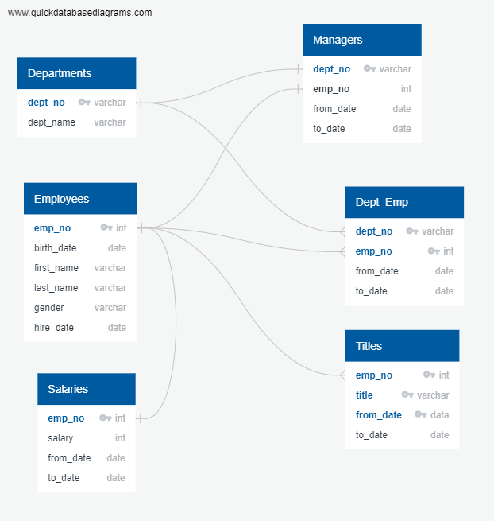
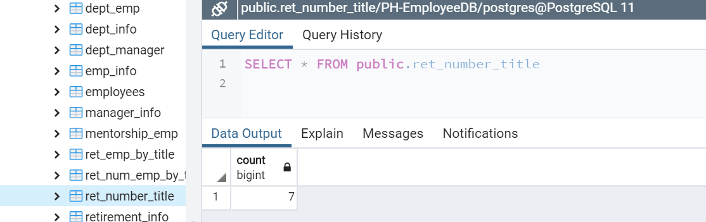
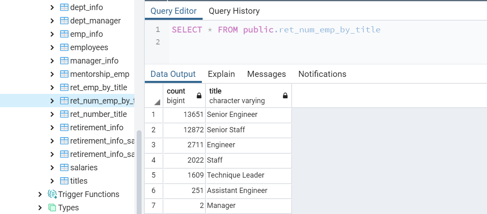
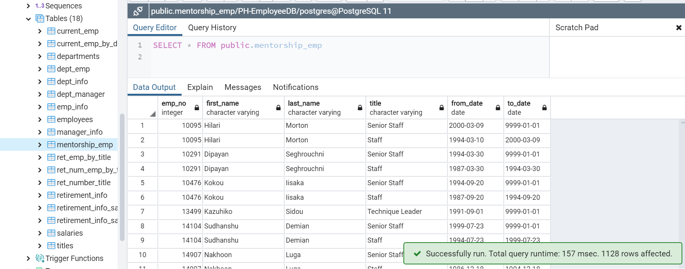

# Pewlett-Hackard-Analysis

## Challenge

### Overview

- Delivering Results: A README.md in the form of a technical report that details the analysis and findings

- Technical Analysis Deliverable 1: Number of Retiring Employees by Title.
    - Three new tables creation:
        - One showing number of retiring
        - One showing number of employees with each title
        - One showing a list of current employees born between Jan. 1, 1952 and Dec. 31, 1955.
	
    New tables are exported as CSVs. 

- Technical Analysis Deliverable 2: Mentorship Eligibility.
    - A table containing employees who are eligible for the mentorship program and the CSV containing the data 

Below are the ERD for the data used for this assignment (EmployeeDB.png):


Schema used: cf. **schema.sql**

All queries used: cf. **queries_Challenge.sql** in [Queries](Queries/) folder

### Steps followed

#### Deliverable 1: Number of Retiring Employees by Title

##### 1.1: List of current employees who are about to retire
In order to retrieved the list of retiring employee by title, we used a partitioning query to remove duplicate employee and to keep only their most recent title.

**NB**: in addition of the condition provided with the challenge (employee must be born between 1952 and 1955), we kept the conditions below that we used during the lessons to retain the employees eligible for retire:
- employees.hire_date BETWEEN '1985-01-01' AND '1988-12-31': employees must have been hired between 1985 and 1988 
- dept_emp.to_date = '9999-01-01': employees must still work for the company as of today 

Below are the data retrieved and store in a new table untitled 'ret_emp_by_title':
- Employee number (ascending)
- First and last name
- Most recent title/position in the company
- Beginning date of the title/position
- Salary

Below is the query used (starting on line 29 in the **queries_Challenge.sql** file in [Queries](Queries/) folder).

```sql
SELECT  emp_no,
		first_name,
        last_name,
        title,
        from_date,
        salary
INTO ret_emp_by_title
FROM
    (SELECT e.emp_no,
        e.first_name,
        e.last_name,
        ti.title,
        ti.from_date,
        s.salary, ROW_NUMBER() OVER
    (PARTITION BY (e.emp_no)
    ORDER BY ti.to_date DESC) rn
    FROM employees AS e
    INNER JOIN salaries AS s ON (e.emp_no = s.emp_no)
    INNER JOIN titles AS ti ON (e.emp_no = ti.emp_no)
    INNER JOIN dept_emp AS de ON (e.emp_no = de.emp_no)
    WHERE (e.birth_date BETWEEN '1952-01-01' AND '1955-12-31')
        AND (e.hire_date BETWEEN '1985-01-01' AND '1988-12-31')
        AND (de.to_date = '9999-01-01')) tmp WHERE rn=1
ORDER BY emp_no;
```

In order to check if there is no duplicate in the results, we ran the two queries below (starting on line 56 in the **queries_Challenge.sql** file in [Queries](Queries/) folder):

```sql
SELECT COUNT(DISTINCT re.emp_no)
FROM ret_emp_by_title as re;
```

    => returning the total number of distinct employee number in our newly created table 'ret_emp_by_title'.

```sql
SELECT COUNT(*)
FROM ret_emp_by_title; 
```

    => returning the total number of records in our newly created table 'ret_emp_by_title'.

As the employee number is unique for each employee, both total should be equal.

##### 1.2: Number of titles retiring
To quantify the number of titles which are impacted, we just count the disctinct values of title stored in our newly created table 'ret_emp_by_title'. The result will be store in a new table named 'ret_number_title'.

Below is the query used (starting on line 65 in the **queries_Challenge.sql** file in [Queries](Queries/) folder).

```sql
SELECT COUNT(DISTINCT ret.title)
INTO ret_number_title
FROM ret_emp_by_title AS ret;
```

##### 1.3: Number of retiring employees for each title
To summarize the results and have the total number of employees who is going to retire for each title, we created a third table untitled 'ret_num_emp_by_title'.

Below is the query used (starting on line 71 in the **queries_Challenge.sql** file in [Queries](Queries/) folder).

```sql
SELECT COUNT(DISTINCT ret.emp_no), ret.title
INTO ret_num_emp_by_title
FROM ret_emp_by_title AS ret
GROUP BY ret.title
ORDER BY COUNT DESC;
```


#### Deliverable 2: Mentorship Eligibility
To fullfil this goal, we used a classic query with tables join to build a new table named 'mentorship_emp'.

Below is the query used (starting on line 81 in the **queries_Challenge.sql** file in [Queries](Queries/) folder).

```sql
SELECT e.emp_no,
	e.first_name,
	e.last_name,
	ti.title,
	ti.from_date,
	ti.to_date
INTO mentorship_emp
FROM employees AS e
INNER JOIN titles AS ti ON (e.emp_no = ti.emp_no)
INNER JOIN dept_emp AS de ON (e.emp_no = de.emp_no)
WHERE (e.birth_date BETWEEN '1965-01-01' AND '1965-12-31')
	AND (e.hire_date BETWEEN '1985-01-01' AND '1988-12-31')
	AND (de.to_date = '9999-01-01');
```

### Results of analysis

All new tables created ('ret_emp_by_title','ret_number_title','ret_num_emp_by_title','mentorship_emp') were exported under .csv files (same names). Those .csv files are located in the [Data](Data/) folder.

First, we noticed that 7 titles/positions are affected by the future retired employees:


Below is the reparition of the 33,118 employees who are going to be retired by their title/position:


We noticed that almost 80% of these employees are at a senior position, so potentially with high skills and experience.
Only two department managers are going to be retired on the 9 total departments.

Finally, we had the list of employees who are going to retire.
Note that control "queries" mentioned before in this report (Deliverable 1, part 1.1) validated the number of total employees impacted: 33,188.


Last info, our last newly created table gave us the list of employees eligibible for the mentorship program. In total, 1,128 employees are eligible.


### Recommendations for further analysis

With the points raised during the lessons (only 5 departments with a current/past manager, salary values that seem to be too low), the first think to do would be to ask if our data are accurate and exhaustive. Providing they are, it would be helpful to categorize the employees eligible for mentorship by title/position. We will, thus, know how many potential mentors are available for each title/position. We could then sort the mentors by experience length (and/or retain only their last title/position) to outline the potential most knowledgeable mentors for each title/position and focus on them first to try to enroll them in the mentorship program.
